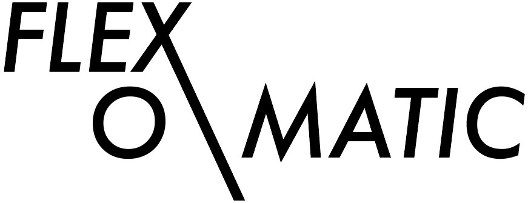

<p align="center">
  
</p>

A component-based flexbox grid system for React, built with `styled-components` and based on the [Solved by Flexbox](https://philipwalton.github.io/solved-by-flexbox/demos/grids/) implementation.

### Why should you use this?

`flexomatic` aims to be a very simple, lightweight grid system with a flexible API that allows you to get up and running in seconds. It is based on the methodology proposed in [Solved by Flexbox](https://philipwalton.github.io/solved-by-flexbox/demos/grids/), where the goal is to expose a minimal grid system that doesn't weigh the user down with a multitude of options.

### Features

* Each `Cell` component is the same width by default
* Full control over individual `Cell` components, including width and alignment
* Responsive, with media query support
* Nested Grids

## Getting started

```
yarn add flexomatic
```

Note that `flexomatic` lists `styled-components` as a `peerDependency`, therefore it expects you to have `styled-components` already installed in your project.

```javascript
import React from 'react'
import { Grid, Cell } from 'flexomatic'

const App = () => (
  <Grid>
    <Cell>1</Cell>
    <Cell>2</Cell>
    <Cell>3</Cell>
  </Grid>
)
```

### Grid

The parent container that initializes a grid. Think of it like a row in bootstrap.

```javascript
import { Grid } from 'flexomatic'

<Grid />
```

**Available props**

`flexCells`

If passed to the `Grid` component, all `Cell` children will have a `display` property of `flex`.

`direction`

Sets the `flex-direction` of the grid. Available options:

* `row` (default)
* `row-reverse`
* `column`
* `column-reverse`

`align`

Aligns `Cell` children using the `align-items` style. Available options:

* `start`
* `center`
* `end`
* `baseline`

### Cell

The individual columns of a grid.

```javascript
import { Cell } from 'flexomatic'

<Cell />
```

**Available props**

`flexed`

Assigns an individual `Cell`'s `display` property to `flex`. This is useful if you want to make a specific `Cell` a flex parent without doing so to its siblings.

`width`

Using a number or keyword, you can explicitly set the `width` of a `Cell` as a percentage value.

```javascript
  // as number
  <Cell width={1} />    // width: 100%

  <Cell width={1/2} />  // width: 50%

  <Cell width={0.25} /> // width: 25%
```

The `Cell` component expects number values for its `width` prop to be greater than 0 and less than or equal to 1.

```javascript
  // as keyword
  <Cell width="full" /> // width: 100%

  <Cell width="half" /> // width: 50%
```

The available keywords for the `width` component are `full`, `half`, `third`, and `fourth`.

| keyword | Width  |
| ------- | ------ |
| full    | 100%   |
| half    | 50%    |
| third   | 33.33% |
| fourth  | 25%    |

**Media Queries**

You can also set the width of `Cell` at different screen sizes by passing an array to the `width` prop with each item in the array representing a different screen size. `flexomatic` uses 3 screen sizes for its media queries:

| Desktop | Tablet | Mobile |
| ------- | ------ | ------ |
| 1024px  | 768px  | 320px  |

```javascript
  // as array
  <Cell width={[0.25, 0.5, 1]} />

  <Cell width={['fourth', 'half', 'full']} />
```

The examples above will result in the styling:

```css
@media (min-width: 320px) {
  .Cell {
    width: 100%;
  }
}

@media (min-width: 768px) {
  .Cell {
    width: 50%;
  }
}

@media (min-width: 1024px) {
  .Cell {
    width: 25%;
  }
}
```

## Contributing

I'd love to get some feedback and contribution from the community. Feel free to file an issue, create a pull request, or leave some feedback as to how you think this project can be improved! 😄
